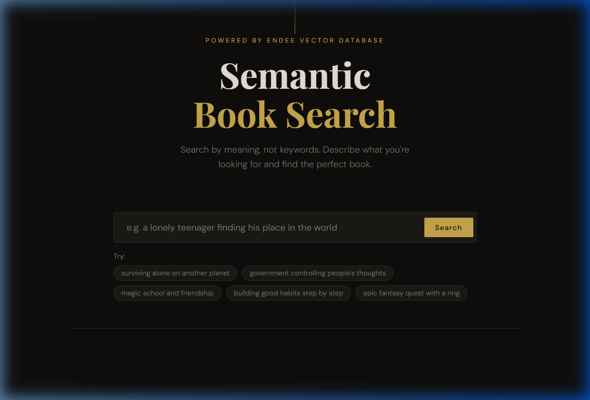
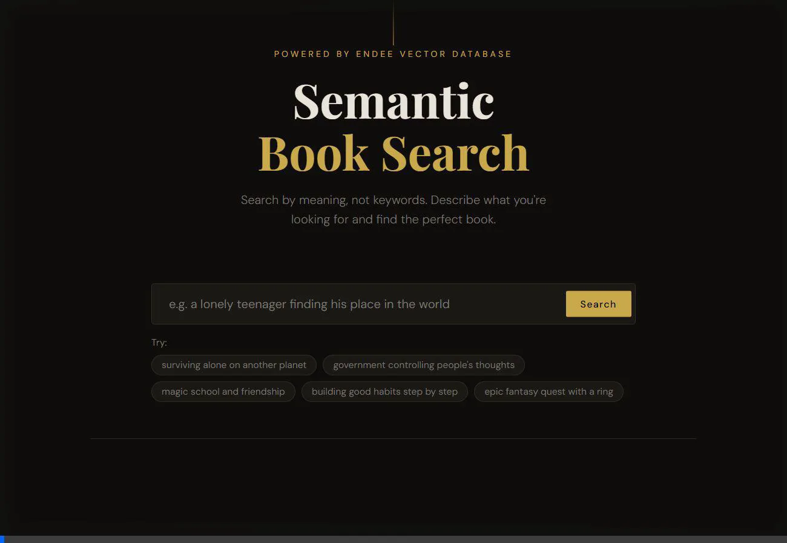
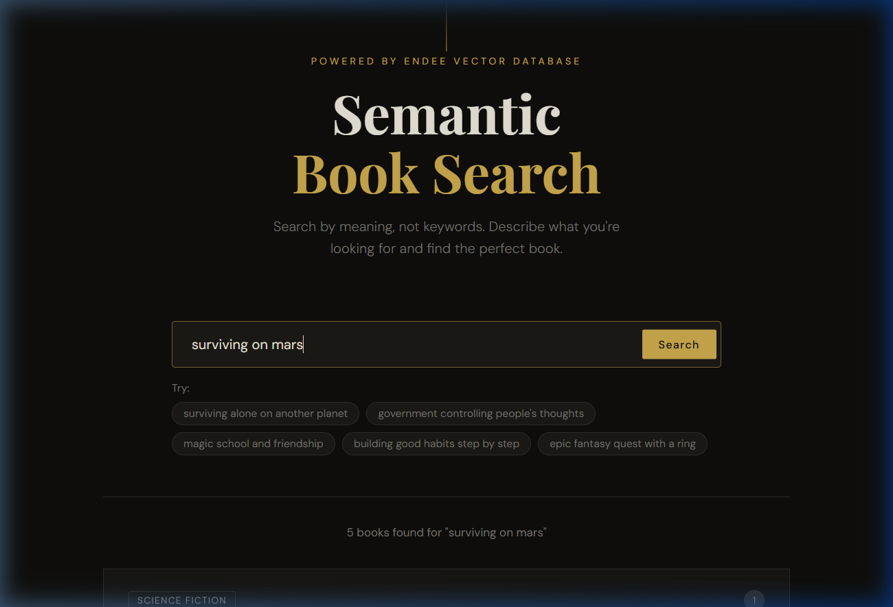
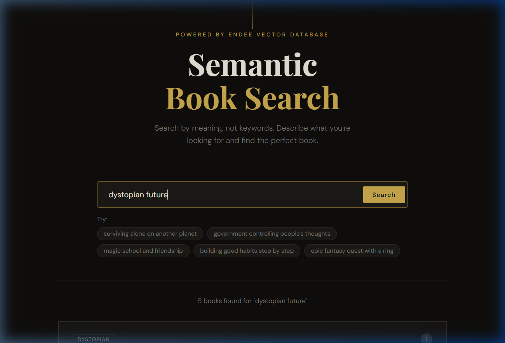
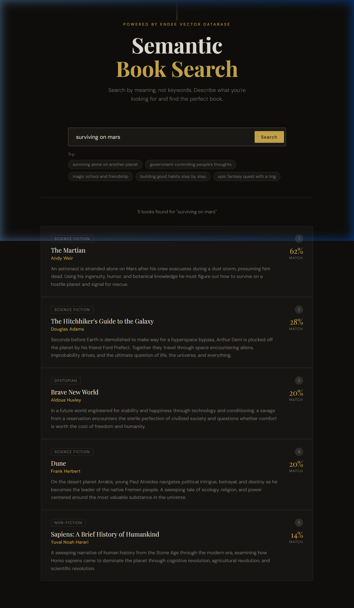

# 📚 Semantic Book Search Engine

**A smart way to find books by their meaning using Endee Vector Database.**

<p align="center">
    
</p>

---

## 🌟 Simple Overview
Have you ever tried to find a book but couldn't remember the name? Traditional search only looks for the exact words you type. **Semantic Search** is different—it understands the **intent** and **context** behind your words. 

If you search for *"surviving alone on a red planet"*, this app will correctly suggest **The Martian**, even if those exact words aren't in the title. This is powered by **Endee**, a next-generation vector database.

---

## 🚀 Demo in Action
Watch the application in action with natural language queries:

<p align="center">
    
</p>

---

## 🔍 Semantic Search Examples (Guaranteed)
If the video above is still loading, here are static "guaranteed" snaps of the system finding books based on meaning:

### 1. "surviving on mars"
Result: **The Martian** by Andy Weir
<p align="center">
    
</p>

### 2. "dystopian future"
Result: **1984** by George Orwell
<p align="center">
    
</p>

---

## ✨ Why this Project?
- **Infinite Scalability**: Built on **Endee**, which scales from a few books to billions of embeddings.
- **Natural Language**: Search like a human, not a robot.
- **Instant Results**: Millisecond-level latency for retrieval.
- **Local AI**: Uses `all-MiniLM-L6-v2` to process text locally—no API keys or external costs.

---

## 🛠️ Features
- **Vector Search**: Uses high-dimensional embeddings to represent book content.
- **HNSW Indexing**: Powering ultra-fast nearest neighbor searches in Endee.
- **Modern UI**: A clean, responsive interface for a premium user experience.
- **Simple Integration**: Easily plug in your own dataset.

---

## 📥 Getting Started

### 1. Setup
```bash
git clone https://github.com/shivam12sin/endee
cd apps/semantic-book-search
npm install
```

### 2. Launch Database
Ensuring the Endee database is running (from the root or project folder):
```bash
docker compose up -d
```

### 3. Ingest Data
Convert the book list into mathematical vectors and store them in Endee:
```bash
npm run ingest
```

### 4. Start Searching
```bash
npm start
# Visit http://localhost:3000
```

---

## 📊 How it Works
1. **User Query**: You type something like "dystopian future".
2. **Embedding**: `Transformers.js` turns your text into a 384-dimensional vector.
3. **Vector Search**: **Endee** finds the closest vectors in the "books" index using cosine similarity.
4. **Results**: The top 5 matching books are displayed instantly.

<p align="center">
    
</p>

---

## 📁 Repository Structure
- `client/`: The frontend interface.
- `server/`: Express API for handling requests and Endee integration.
- `data/`: The book dataset JSON.
- `docs/assets/`: Screenshots and demos.

---

## 📝 License
MIT
