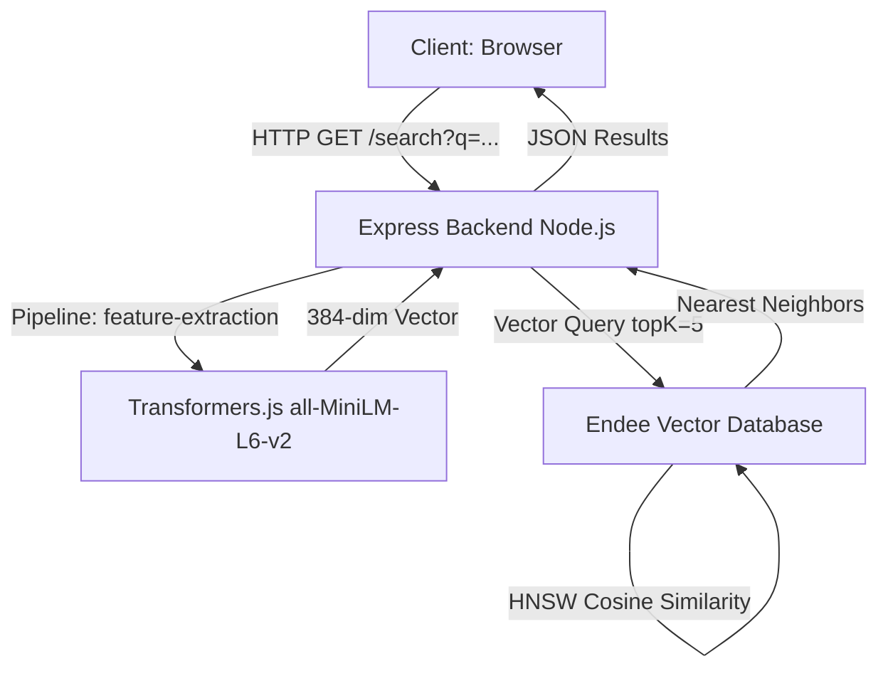

# Semantic Book Search Engine

A high-performance semantic search application that leverages vector embeddings to find books by contextual meaning rather than simple keywords. Powered by **Endee Vector Database** and **Transformers.js**.

---

## Overview

Traditional keyword-based search engines often fail to return relevant results when users provide natural language descriptions instead of exact titles or authors. For instance, a query like *"a lonely teenager finding his place in the world"* would typically miss **The Catcher in the Rye**. 

This project implements **Semantic Search**, which understands the underlying intent and context of a query. By mapping text to a high-dimensional vector space, the application surfaces the most relevant titles instantly.

---

## System Architecture

The following diagram illustrates the flow of data from a user's natural language query to the retrieval of contextually relevant results.



---

## Core Technologies

| Component | Technology | Description |
|-----------|------------|-------------|
| **Vector Database** | [Endee](https://www.npmjs.com/package/endee) | High-performance vector storage and similarity search. |
| **Embedding Model** | [Transformers.js](https://xenova.github.io/transformers.js/) | Runs `all-MiniLM-L6-v2` locally for zero-latency inference. |
| **Backend** | Node.js + Express | Handles orchestration, embedding generation, and API routing. |
| **Frontend** | Vanilla HTML/CSS/JS | A clean, responsive search interface. |
| **Infrastructure** | Docker | Containerized Endee server for easy deployment. |

---

## Setup & Implementation

### Prerequisites
- Node.js 18+
- Docker & Docker Compose

### 1. Installation
Clone the repository and install dependencies:
```bash
git clone https://github.com/YOUR_USERNAME/semantic-book-search
cd semantic-book-search
npm install
```

### 2. Infrastructure Initialization
Start the Endee Vector Database using Docker:
```bash
docker compose up -d
# Database accessible at http://localhost:8080
```

### 3. Data Ingestion
Generate embeddings for the book dataset and store them in the vector database:
```bash
npm run ingest
```
> [!NOTE]
> The first run will download the `all-MiniLM-L6-v2` model (~25MB). Subsequent runs will use the cached local model.

### 4. Deployment
Start the unified API and UI server:
```bash
npm start
# Application accessible at http://localhost:3000
```

---

## Semantic Query Examples

| User Query | Interpretation | Expected Result |
|------------|----------------|-----------------|
| `surviving alone on another planet` | Sci-fi, isolation, survival | *The Martian* |
| `government controlling thoughts` | Dystopian, surveillance | *1984* |
| `magic school and friendship` | Fantasy, young adult | *Harry Potter* |
| `building good habits` | Self-improvement, psychology | *Atomic Habits* |
| `lonely teenager finding his place` | Coming of age, alienation | *The Catcher in the Rye* |

---

## Implementation Details

### How Endee is Utilized
Endee is the analytical core of the application, managing the complex task of similarity searching at scale.

- **Indexing**: `client.createIndex()` initializes a cosine similarity index optimized for 384 dimensions.
- **Upsertion**: `index.upsert()` stores document vectors alongside their metadata (title, author, genre).
- **Querying**: `index.query()` executes a Hierarchical Navigable Small World (HNSW) search to find the closest matches in milliseconds.

---

## License

This project is licensed under the MIT License.
ry | Expected Top Result |
|-------|-------------------|
| `surviving alone on another planet` | The Martian |
| `government controlling people's thoughts` | 1984 |
| `magic school and friendship` | Harry Potter |
| `building good habits step by step` | Atomic Habits |
| `epic fantasy quest with a ring` | The Lord of the Rings |
| `lonely teenager finding his place` | The Catcher in the Rye |

---

## 📁 Project Structure

```
semantic-book-search/
├── client/
│   └── index.html        # Frontend search UI
├── data/
│   └── books.json        # Book dataset (20 books)
├── server/
│   ├── index.js          # Express API server
│   └── ingest.js         # One-time data ingestion script
├── docker-compose.yml    # Endee vector database
├── package.json
└── README (1).md
```

---

## 📄 License

MIT
